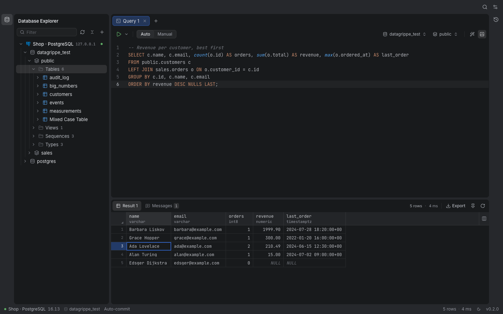
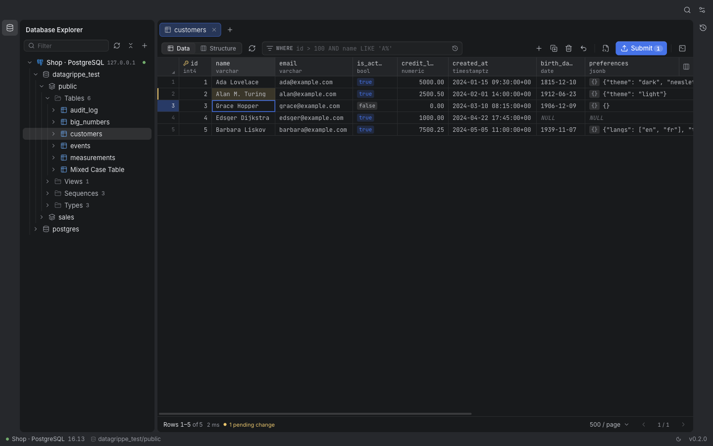
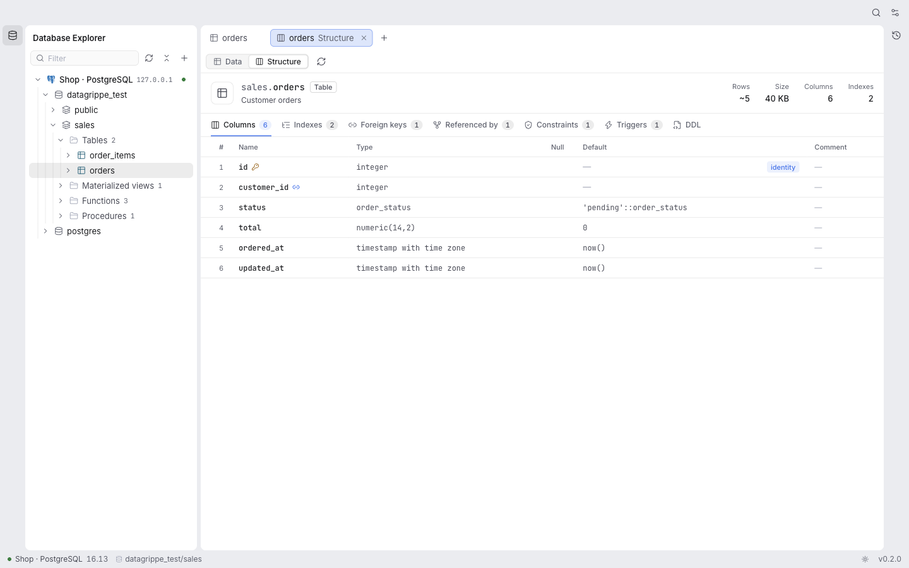
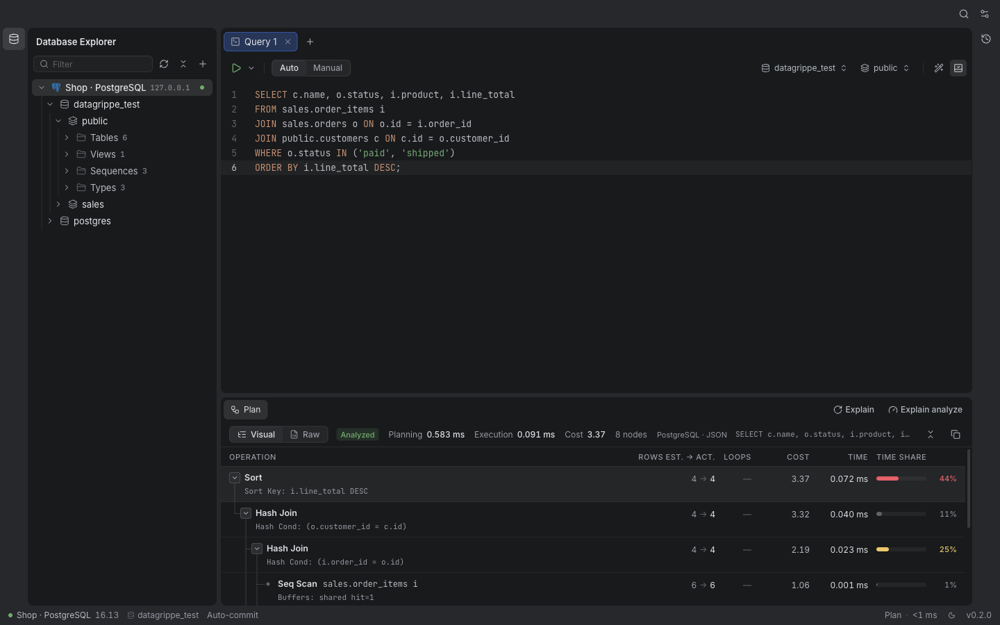
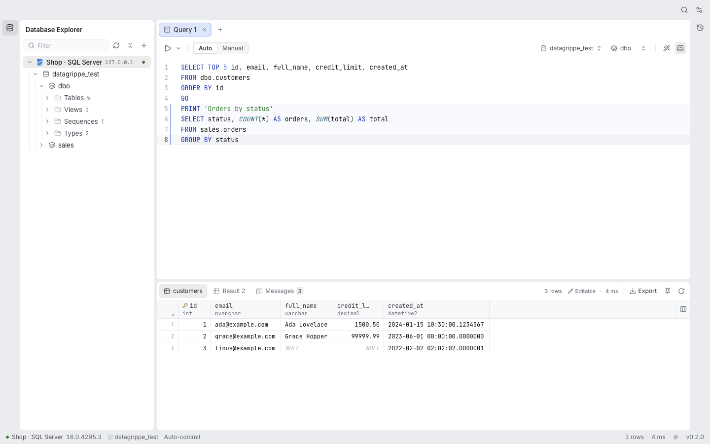
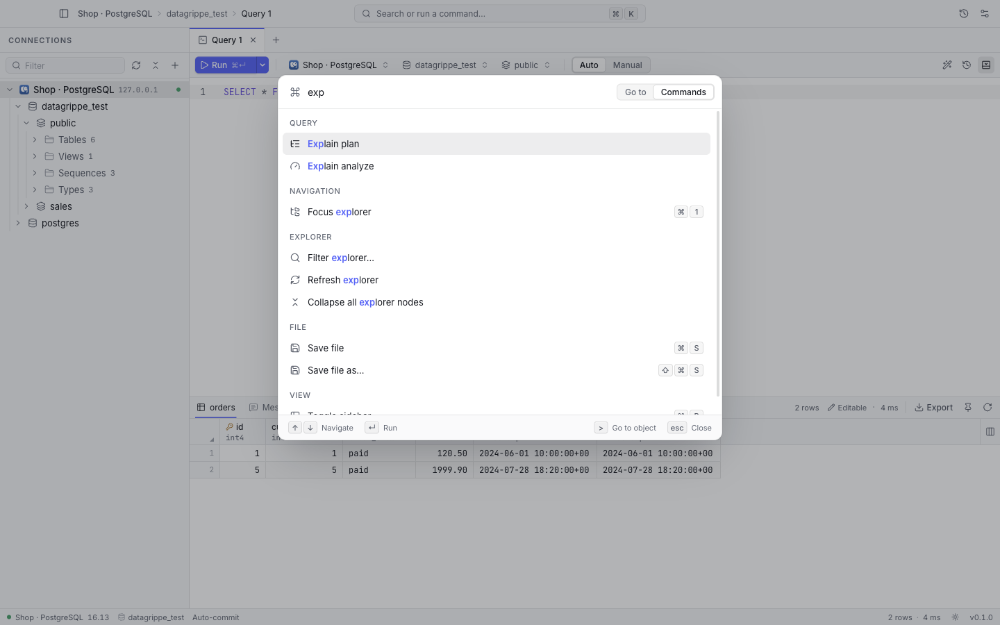
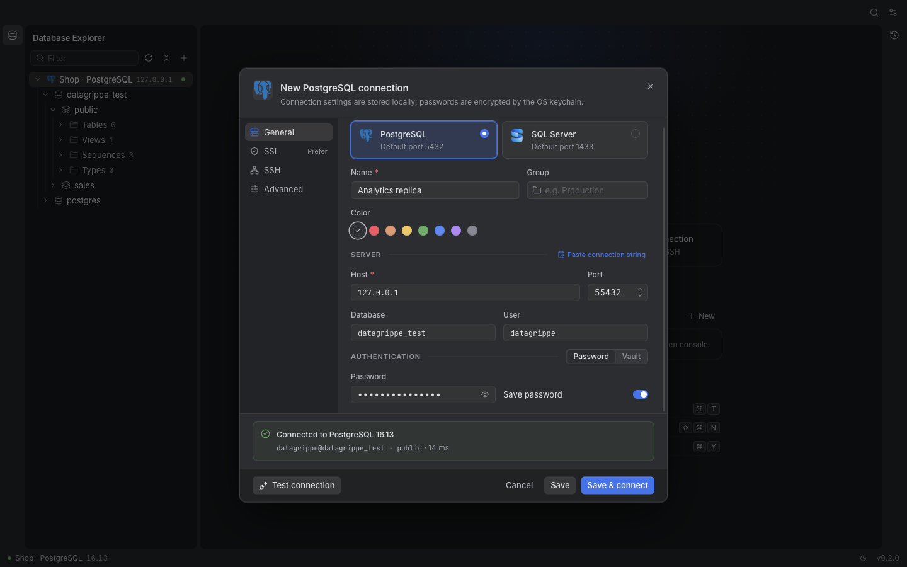
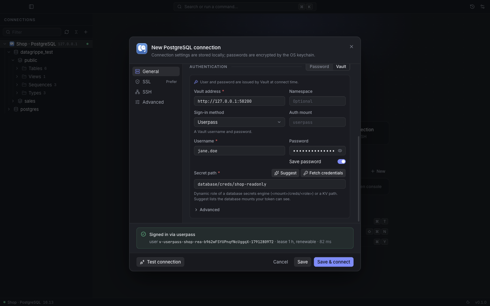
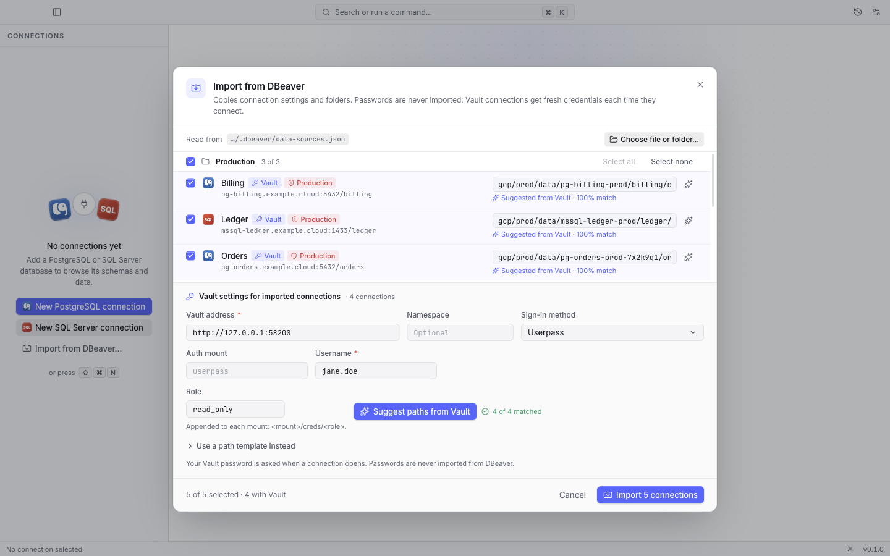

<p align="center">
  
</p>

<h1 align="center">DataGrippe</h1>

<p align="center">A fast, keyboard-first database IDE for <b>PostgreSQL</b> and <b>SQL Server</b>, with a calm, modern interface.</p>



DataGrippe is a desktop app in the spirit of DataGrip, focused on the everyday work of a developer who
writes SQL: browse a schema, run a script, look at the results, fix a row, read a plan. Everything is
reachable from the command palette (⌘K), and the app works in a dark and a light theme.

## Features

**Connections**
- PostgreSQL and SQL Server (named instances included), TLS modes from `disable` to `verify-full`, client certificates.
- SSH tunnels (password, private key or agent) with host key verification against `~/.ssh/known_hosts` and trust on first use.
- Passwords encrypted with the OS keychain (Electron `safeStorage`); they never reach the renderer.
- HashiCorp Vault authentication: the database user and password come from Vault at connect time (dynamic
  users of the database secrets engine, static roles or a KV secret), renewed and revoked for you. See
  [Vault authentication](#vault-authentication).
- Import from DBeaver (*File ▸ Import from DBeaver…*): folders, SSL/SSH settings, production flags and Vault
  connections. DBeaver's encrypted credentials file is never read. See [Import from DBeaver](#import-from-dbeaver).
- Read-only connections (enforced server-side and by a statement classifier) and *Production* connections that ask before `DROP`, `TRUNCATE` or a `DELETE`/`UPDATE` without `WHERE`.
- Paste a connection string to fill the dialog; per-connection session time zone for PostgreSQL.

**Console**
- Monaco editor with dialect-aware highlighting, context-aware completion (schemas, tables, columns, aliases, quoted identifiers), formatting and snippets.
- Run the statement under the caret (⌘↵) or the whole script (⇧⌘↵); SQL Server `GO` batches; per-console database and schema.
- Auto-commit or manual transactions, with a guard before closing a console or quitting with an open transaction.
- Query parameters (`:name`, `$1`, `?`, `@name`, `${name}`) prompted before a run.
- Server messages (`RAISE NOTICE`, `PRINT`) shown live while a script runs; errors underlined in the editor.
- Explain and explain analyze, as a visual plan tree or the raw plan.
- Query history with search, per-connection filtering and re-run.

**Results and data**
- Virtualized grid with keyboard navigation, multi-cell selection, find (⌘F), quick value filters, column hide/reorder/freeze, and a cell inspector (JSON, XML, long text).
- Exact values: big integers, `numeric`, dates and times are never rounded by JavaScript.
- Copy or save as CSV, TSV, JSON, Markdown or SQL `INSERT`; stream *all* rows of a query to a file (cancellable).
- Table editor: paging, server-side filter and sort, inline edits, inserts, deletes, paste from a spreadsheet, preview of the SQL, submit in one transaction. Foreign keys can be followed both ways.
- Results of a single-table `SELECT` with its primary key can be edited in place.
- CSV import into a table with column mapping, progress and cancel (all-or-nothing).

**Explorer**
- Databases, schemas, tables, views, materialized views, functions, procedures, sequences, types and SQL Server synonyms.
- Structure view (columns, indexes, keys, references, constraints, triggers) and faithful DDL (partitions, inheritance, RLS policies, identity options, temporal tables…).
- Server sessions view with cancel and terminate.

| | |
|---|---|
|  |  |
|  |  |
|  |  |
|  |  |

## Vault authentication

Choose *Authentication ▸ HashiCorp Vault* in the connection dialog. The database user is no longer typed: it is
issued by Vault each time DataGrippe connects. *Fetch credentials* signs in and reads the secret once (a dynamic
lease is revoked right away) so the settings can be checked before saving; *Test connection* also opens a
database session with them.

**Works like the vault CLI.** DataGrippe reads `VAULT_ADDR`, `VAULT_NAMESPACE` and `VAULT_CACERT` the way your
terminal sees them: from the environment, or, when the app was started from the Finder, from your login shell
(`~/.zshrc`…), once at startup. A new Vault connection (or a DBeaver import) starts with that address and the
*Vault CLI token* method, which reuses the token of `vault login` — the same setup as DBeaver's Vault plugin, without
its Java trust store: the Vault certificate is verified against the CAs this Mac trusts (Keychain), plus
`VAULT_CACERT` or a CA file set on the connection.

**Settings**: the Vault address (`https://…`; a trailing `/v1` or an address copied from the web UI, `…/ui/…`, is
cleaned up; plain `http://` is only accepted for a Vault on this machine), an optional Enterprise namespace, the
sign-in method, and the secret path — *Suggest* lists the database secrets engines your token can see and picks the
one matching the connection. Advanced: the KV keys of the user name and password (default `username` /
`password`), a PEM CA bundle for a private Vault certificate, and *Revoke lease on disconnect* (on by default).

**Sign-in methods**

| Method | How it works |
|---|---|
| Vault CLI token (recommended with `vault login`) | `VAULT_TOKEN`, then `~/.vault-token` (written by `vault login`), then a token saved on the connection (Advanced). When none is valid (missing or expired), DataGrippe signs in with the browser exactly like `vault login -method=oidc` (switch *Sign in with the browser…*, on by default) instead of asking for a token. The CLI token is only sent to the server named by `VAULT_ADDR` (environment or login shell); without any `VAULT_ADDR`, a native dialog asks first (*Don't ask again for this server* is remembered until *Sign out of Vault*). |
| OIDC (browser SSO) | Same flow as `vault login -method=oidc`: the browser opens, the callback lands on `http://localhost:8250/oidc/callback` (that redirect URI must be allowed by the Vault OIDC role). Optional role and auth mount (default `oidc`). The browser sign-in is kept encrypted until it expires, so it does not open at every start. |
| LDAP / Userpass | User name in the connection, password asked at sign-in (default mounts `ldap` / `userpass`). |

**Secret paths**: the path without `/v1/`. The answer decides the kind, no engine setting is needed.

| Path | Kind |
|---|---|
| `database/creds/<role>` | Dynamic: a temporary database user with a lease. |
| `database/static-creds/<role>` | Static role: a fixed user whose password Vault rotates; re-read after each rotation. |
| `secret/data/<path>` (KV v2), `kv/<path>` (KV v1) | Static secret; the user name and password keys are configurable. |

Vault's own APIs (`auth/…`, `sys/…`, `identity/…`, `cubbyhole/…`, `token/…`) are refused as secret paths. A
permission error on the path says which token was used (VAULT_TOKEN, the CLI token, the saved token or a sign-in).

**Finding the secret path** (*Suggest*, and *Suggest paths from Vault* in the DBeaver import): organisations often
mount one database secrets engine per instance, e.g. `<cloud>/<env>/<team>/<instance-id>/<database>`, whose role
(`read_only` by default, editable) is read at `<mount>/creds/<role>`. DataGrippe signs in, lists the database mounts
the token can see (`sys/internal/ui/mounts`, allowed by Vault's default policy) and matches each connection by its
database name, host labels, name, engine and environment (a *PROD* folder never picks a staging mount). Ties and
weak matches are left for you to pick in the list, best matches first.

**Leases**
- A dynamic lease is renewed in the last third of its duration, and the Vault token that issued it is renewed too
  (Vault revokes a token's leases when the token expires): the deadline shown is the earliest of the two.
- When neither can be extended any more (max TTL), new credentials are issued shortly before the deadline. New
  server connections use them; open consoles keep their user until it is about to be dropped, then idle consoles
  are moved to the new user in place, and a console with an open transaction is closed with the reason shown.
  For an OIDC sign-in that cannot be extended, the status asks to sign in again before the deadline.
- After the laptop sleeps, overdue renewals run as soon as it wakes up. When the database refuses the Vault
  credentials (revoked lease, rotated password), the secret is read again once and the connection retried.
- On disconnect, delete and quit, dynamic leases are revoked (`sys/leases/revoke`), which drops the temporary user.
  Vault's default policy does not allow it: *Fetch credentials* and the status then warn that the user stays
  until its lease expires.
- The explorer badge and the status bar chip show the user, the kind, the deadline and the token source; the
  palette command *Copy Vault database user* copies the current user.

**What is stored where**
- The connection file stores the Vault settings only (address, namespace, method, mount, role, user name, path).
- With *Save password* on, the Vault token or LDAP/userpass password is stored encrypted with Electron
  `safeStorage`, like database passwords; otherwise it is kept in memory until the app quits. A saved Vault secret
  is dropped when the Vault address, namespace, method, mount or user changes.
- Browser (OIDC) sign-ins are kept encrypted with `safeStorage` in `vault-tokens.json` until they expire, and
  checked with Vault (`lookup-self`) before reuse; *Sign out of Vault* deletes them. LDAP / userpass sign-ins and
  the issued database passwords stay in main-process memory only. None of them reach the renderer, the logs, error
  messages or the query history, and DataGrippe never writes `~/.vault-token`.

**Automation guard**: when the app is driven by automation (`DATAGRIPPE_AUTOMATION=1` or Playwright), every
database, SSH and Vault target must be a loopback host (`localhost`, `127.x.x.x`, `::1`), the login shell is never
read, and the default DBeaver workspace is only scanned when `HOME` was substituted. Tests and scripts can therefore never reach a real server,
even with connections imported from a real workspace (`src/main/automation-guard.ts`).

## Import from DBeaver

*File ▸ Import from DBeaver…*, also in the command palette and in the explorer's *Add connection* (+) menu.

**What is read**: only files named `data-sources*.json`, from the DBeaver workspace
(`~/Library/DBeaverData/workspace6/*/.dbeaver/` on macOS, `%APPDATA%\DBeaverData\workspace6` on Windows,
`~/.local/share/DBeaverData/workspace6` plus Flatpak / Snap on Linux), or from the file or folder picked with
*Choose file or folder…*. DBeaver keeps passwords in an encrypted `credentials-config.json`: it is never opened,
so no password is imported.

**Mapping**
- PostgreSQL (and Greenplum, TimescaleDB, EDB as PostgreSQL) and SQL Server connections; other engines are listed
  as unsupported. Host, port, database, user, SQL Server named instance, default schema, read-only flag.
- DBeaver folders become connection groups; SSL settings map to the closest TLS mode; the first SSH tunnel is
  kept (its password or passphrase is asked when connecting).
- The *Production* connection type (or a red type, *confirm execute*, a "prod" folder or name) turns on the
  production guard and the red color.
- Connections already in DataGrippe (same engine, host, port and database) are marked as duplicates and left
  unchecked. Each row lists what could not be mapped.
- `auth-model: vault` connections become Vault connections sharing one set of Vault settings in the dialog:
  address (prefilled from `VAULT_ADDR`), namespace, sign-in method (*Vault CLI token* when `vault login` is set up)
  and the role. *Suggest paths from Vault* fills every row with the matching database mount
  (`<mount>/creds/<role>`); rows without a clear match get a picker of the visible mounts. A path template
  (`{database}`, `{name}`, `{host}`) remains available for predictable layouts, and any row's path can be typed.
  Hints found in DBeaver's Vault settings prefill the panel; the *Token* method is never taken from a file.

**What you fill in**: usually nothing but a check — with `VAULT_ADDR` exported and `vault login -method=oidc` done,
click *Suggest paths from Vault*, review the paths and import; for password connections, the password at the first
connect.

## Download

Each GitHub release carries two DMGs: `DataGrippe-<version>-arm64.dmg` for Apple silicon and
`DataGrippe-<version>-x64.dmg` for Intel Macs. Open the DMG and drag DataGrippe to Applications.

The app is signed ad hoc but not notarized by Apple, so macOS blocks its first launch. Either run once

```sh
xattr -dr com.apple.quarantine /Applications/DataGrippe.app
```

or try to open it, then choose *Open Anyway* in *System Settings ▸ Privacy & Security*. After an update, macOS may
ask again for the *DataGrippe Safe Storage* keychain item (saved passwords): choose *Always Allow*.

## Install and run from source

Requirements: Node.js 24 and npm. Docker is only needed for the integration and end-to-end tests.

```sh
npm install
npm run dev        # the app with hot reload
```

Connections, settings and the workspace live in the Electron user-data folder (*Help ▸ Open data folder*).
Set `DATAGRIPPE_USER_DATA_DIR` to an absolute path to use another folder (a throwaway profile, for example).

## Packaging

```sh
npm run dist:dir       # dist/mac-arm64/DataGrippe.app (unpacked, quick to try)
npm run dist           # dist/DataGrippe-<version>-<arch>.dmg for this Mac
npm run dist:release   # both DMGs: arm64 (Apple silicon) and x64 (Intel)
```

Builds are signed ad hoc (`identity: "-"`, hardened runtime with electron-builder's default entitlements) and not
notarized: see *Download* for the first launch. The app icon is `build/icon.png` (its source is `build/icon.svg`).

## CI and releases

- `.github/workflows/ci.yml` runs on every push to `main` and every pull request: typecheck, unit tests and a
  build, then the integration tests against the docker containers (Ubuntu runners).
- `.github/workflows/release.yml` runs the same checks, then builds and verifies both DMGs on a macOS runner.
  A tag `v<version>` publishes them as a GitHub release; a manual run (*Actions ▸ Release ▸ Run workflow*) only
  uploads them as a workflow artifact.

To release, bump the version and push the tag (it must match `package.json`):

```sh
npm version patch          # or minor / major: commits package.json and tags v<version>
git push --follow-tags
```

The end-to-end suite drives the macOS app and is not part of CI: run `npm run test:e2e` before a release.

## Tests

```sh
npm run typecheck          # main/preload/tests and renderer TypeScript projects
npm run test:unit          # vitest, colocated *.test.ts(x) under src/

npm run db:up              # PostgreSQL 16 on 127.0.0.1:55432, SQL Server 2022 on 127.0.0.1:51433, dev Vault on 127.0.0.1:58200
npm run test:integration   # seeds both databases and configures Vault, then tests the drivers and the session manager
npm run test:e2e           # builds, then Playwright drives the Electron app against both databases and Vault
npm run db:down
```

- `DATAGRIPPE_TEST_DB=postgres|mssql` limits seeding to one engine.
- `DATAGRIPPE_TEST_DB_NAME=<name>` seeds and uses its own database, so concurrent runs don't collide.
- `DATAGRIPPE_SHOTS_DIR=<dir>` collects the end-to-end step screenshots.
- `DATAGRIPPE_DOCS_SCREENSHOTS=1 npx playwright test docs-screenshots` (after `npm run build`) refreshes the
  screenshots of this README in `docs/screenshots/`.

Test credentials live in `tests/test-env.ts`; they only work against the throwaway containers.

The dev-mode Vault (root token in `tests/test-env.ts`) reaches the databases inside the compose network as
`postgres:5432` and `mssql:1433`. The integration setup configures it idempotently (`tests/setup/vault.ts`), with
every object prefixed by the test database name: a database secrets engine `<db>-database` (roles `<db>-pg-ro`,
`<db>-pg-short` with an 8 s TTL, `<db>-mssql-ro`), a KV v2 mount `<db>-kv` and a userpass mount `<db>-userpass`
(users `<db>-alice` with a reader policy and `<db>-bob` with a denying one). Without the Vault container the
Vault tests are skipped with a warning. The end-to-end suite gives every app its own user-data folder and `HOME`,
and runs under the automation guard, so it never sees the developer's DBeaver workspace or Vault token.

## Architecture

```
src/shared/      Domain types, the IPC contract, and the SQL toolkit (lexer, splitter, classifier, quoting, formatting)
src/main/        Electron main process: IPC handlers, native menu, persistence, exports and imports
  db/            Session manager, SSH tunnel, host keys, and one driver per engine (postgres/, mssql/)
  vault/         HashiCorp Vault client, sign-in methods, credentials and lease renewal / revocation
  import/        CSV import and the DBeaver connection importer
src/preload/     A typed bridge exposed as window.datagrippe
src/renderer/    React 19 UI: stores (zustand), components per feature, Monaco setup, the virtualized grid
tests/           Integration tests against the docker databases, Playwright end-to-end tests, seed data
```

- **Process boundary.** The renderer is sandboxed (`contextIsolation`, `sandbox`, no Node). Every call
  goes through one typed contract (`src/shared/ipc.ts`); main validates arguments and answers with an
  envelope carrying either a value or a `DbErrorInfo`.
- **Drivers.** `pg` + `pg-cursor` and `mssql`/tedious implement a small `DbDriver` contract
  (`src/main/db/types.ts`): a metadata provider on a small pool, and one dedicated server session per
  console tab. Values are normalized in main to structured-clone-friendly `CellValue`s without precision loss.
- **Safety.** Read-only connections are enforced at two levels (a lexer-based statement classifier and
  the server's read-only transaction mode); table edits are parameterized and run in one transaction.
- **Shortcuts.** Global shortcuts are native menu accelerators that send a command id to the renderer's
  command registry, which also feeds the palette.

## Known limitations

- macOS is the only packaging target; builds are signed ad hoc, not notarized.
- PostgreSQL partitions are not listed as explorer nodes (the parent's DDL contains the whole partition tree).
- A PostgreSQL result larger than 10,000 rows that stays idle for 10 seconds releases its cursor, so locks
  and snapshots are not held; *Load more* then asks to run the query again.
- SQL Server *Load more* re-runs the query and skips the rows already shown; it stops with a clear error when
  the data changed meanwhile.
- Per-statement results of a script are shown when the script ends (server messages are live).
- CSV import uses batched `INSERT` statements, not `COPY` / bulk insert, so very large files are slower than
  a native loader.
- Snippets are managed from the palette (*Insert snippet…*); there is no Settings page for them yet.

## Credits

The PostgreSQL elephant is a trademark of the PostgreSQL Community Association; the SQL Server logo is a trademark
of Microsoft. Both are only used to tell the two engines apart.
